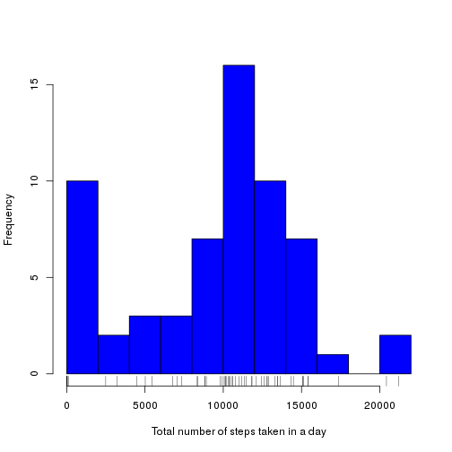
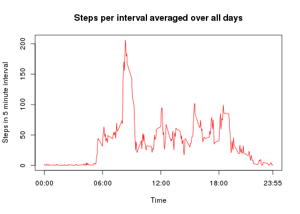
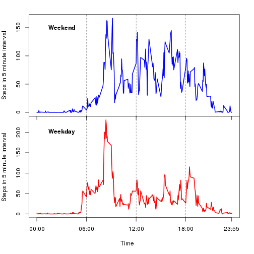

Reproducible Research: Peer Assessment 1
========================================
Harry Braviner


## Loading and preprocessing the data

We unzip the data (if necessary), read it in as a data frame and convert the **date** variable from the *factor* to the *date* datatype.


```r
if(!file.exists("activity.csv"))
  unzip("activity.csv")
data <- read.csv("activity.csv")
data$date <- as.Date(data[,"date"])
```


## What is mean total number of steps taken per day?

Let's first compute a vector containing the total number of steps taken each day and produce a histogram (I'm putting a rug under it since I think it adds useful information).


```r
stepCounts <- by(data$steps, data$date, sum, na.rm=TRUE)
hist(stepCounts, breaks=10, col = "blue", main = "", xlab = "Total number of steps taken in a day")
rug(stepCounts)
```

 

Now we compute the mean and median steps-per-day.


```r
meanSteps <- mean(stepCounts)
medianSteps <- median(stepCounts)
```

The mean number of steps-per-day is 9354.2295082 and the median number of steps-per-day is 10395.

## What is the average daily activity pattern?

Create a vector of the averages over all days of the number of steps in each interval.
The names of this vector correspond to the times.


```r
averagedStepsPerInterval <- by(data$steps, data$interval, mean, na.rm=TRUE, simplify=TRUE)
```

I've changed the labelling of the x-axis to be the actual time, since the interval numbers aren't very nicely formatted (i.e. I think "15:00" is clearer than "1500" as a label for 3pm!)


```r
plot(names(averagedStepsPerInterval), averagedStepsPerInterval, type="l", col="red",
      xlab="Time", ylab="Steps in 5 minute interval", xaxt="n",
      main="Steps per interval averaged over all days")
axis(side=1, at = c("0", "600", "1200", "1800", "2355"),
      labels = c("00:00", "06:00", "12:00", "18:00", "23:55"))
```

 

## Inputing missing values


```r
totalMissing <- sum(is.na(data$steps) | is.na(data$date) | is.na(data$interval))
totalMissing
```

```
## [1] 2304
```
So there are 2304 observations where at least one of the variables is missing.

As an aside, we can see from the fact that the next bit of code that all of these NAs are in the **steps** variables;
no observations of the **date** or **interval** have been coded as NA.

```r
sum(is.na(data$date))
```

```
## [1] 0
```

```r
sum(is.na(data$interval))
```

```
## [1] 0
```

My strategy for filling in the missing data is to replace each missing value with the mean for that 5-minute interval, averaged over all the days for which that interval does have data.
This is convenient, since I computed a vector of such values in the previous section.


```r
# Note that this makes a copy of the data frame
# (unlike a data table, where we're just create a reference)
dataWithMeans <- data
# Now loop through the rows replacing the steps entry with the mean
# value as necessary
for (i in 1:nrow(dataWithMeans)){
  if(is.na(dataWithMeans[i,"steps"]))
    dataWithMeans[i,"steps"] <- averagedStepsPerInterval[as.character(dataWithMeans[i,"interval"])]
}
```

Just as a check that this has been done correctly, let's look at a couple of examples where the original data has missing values and check that the replacement has worked


```r
data[10, "steps"]
```

```
## [1] NA
```

```r
dataWithMeans[10, "steps"]
```

```
## [1] 1.471698
```

```r
dataWithMeans[10, "interval"]
```

```
## [1] 45
```

```r
averagedStepsPerInterval["45"]
```

```
##       45 
## 1.471698
```
So this has indeed replaced NAs with values from the vector of means.


## Are there differences in activity patterns between weekdays and weekends?

First let's add a new variable called **weekday** to the data, using an anonymous function.

```r
dataWithMeans$weekday <- sapply(dataWithMeans$date,
                                 function(d) {w <- weekdays(d);
				               if(w == "Saturday" | w == "Sunday") {
					         return("weekend")
					       } else {
					         return("weekday")
					       }
					      })
#The new variable is of type character, so we now convert it to a factor variable
dataWithMeans$weekday <- as.factor(dataWithMeans$weekday)
```

Now create a pair of vectors containing the mean across all weekdays and weekend days.

```r
weekdayMeanSteps <- by(dataWithMeans[dataWithMeans$weekday == "weekday", "steps"],
                        dataWithMeans[dataWithMeans$weekday == "weekday", "interval"],
			mean)
weekendMeanSteps <- by(dataWithMeans[dataWithMeans$weekday == "weekend", "steps"],
                        dataWithMeans[dataWithMeans$weekday == "weekend", "interval"],
			mean)
```

And finally we create our two plots.
I'm going to use the base (rather than the lattice) plotting system because that's what I know best at this point.

```r
par(mfcol=c(2,1), mar = c(0,4,0,2), oma=c(5,0,2,0))
plot(names(weekendMeanSteps), weekendMeanSteps, type="l", col="blue", lwd=2,
      xlab = "", ylab="Steps in 5 minute interval", xaxt="n", main="")
axis(side=1, at=c("0000", "600", "1200", "1800", "2355"),
      #labels=c("00:00", "06:00", "12:00", "18:00", "23:55"))
      labels=c("", "", "", "", ""))
# Plot some vertical guide lines just to make the plot clearer
abline(v = c("600", "1200", "1800"), lty=2, lwd=0.5)
# Label this as the weekend data
text("0300", 150, "Weekend", font=2)
plot(names(weekdayMeanSteps), weekdayMeanSteps, type="l", col="red", lwd=2,
      xlab = "", ylab="Steps in 5 minute interval", xaxt="n", main="")
axis(side=1, at=c("0000", "600", "1200", "1800", "2355"),
      labels=c("00:00", "06:00", "12:00", "18:00", "23:55"))
# Plot some vertical guide lines just to make the plot clearer
abline(v = c("600", "1200", "1800"), lty=2, lwd=0.5)
# Label this as the weekday data
text("0300", 200, "Weekday", font=2)
# Setting xlab="Time" in the above plot() call doesn't seem to actually
# give me a label on the x-axis - probably because it has zero margin
# size to draw in. The following gives us the x-axis label
mtext("Time", side=1, outer=TRUE, line=3)
```

 
